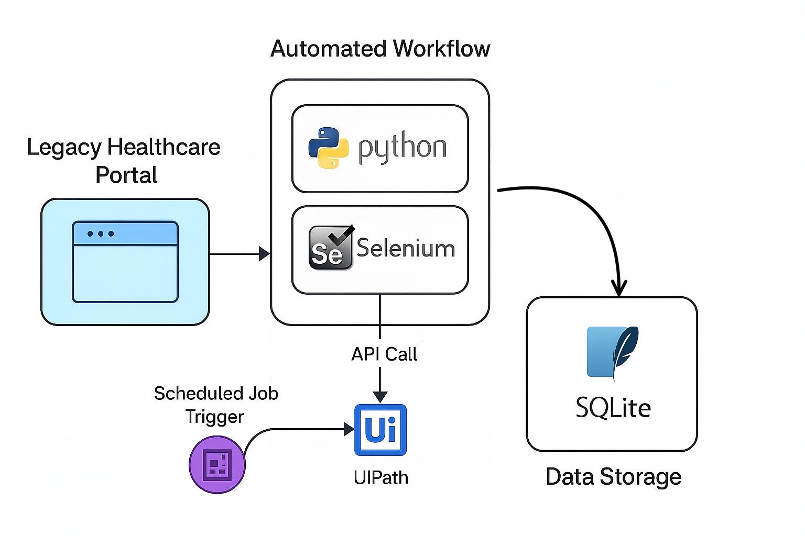

# 🏥 Healthcare Portal Automation (Selenium + FastAPI + SQLite)

## 🔍 Project Overview
This project simulates automation for a legacy healthcare portal that lacks modern APIs.  
It demonstrates secure, auditable automation to extract claims data and expose it through a secure API.

The goal is to show how legacy, manual processes in healthcare can be modernized with automation and APIs, aligning with cloud migration and secure data handling standards.

---

## 🛠️ Technology Stack
- Python 3.11+
- **FastAPI** (API Framework)
- **Selenium** (Web Automation)
- **SQLite** (Lightweight Database)
- **SQLAlchemy** (ORM)
- Logging (Audit-Focused)

---

## 📊 Architecture Overview
Below is the architecture for this project showing data flow from a mock legacy portal to SQLite storage.

---

## 📂 Project Structure

healthcare_portal_automation/
│
├── main.py               # FastAPI app (secured API endpoints)
├── selenium_scraper.py    # Selenium scraper for legacy portal
├── database.py            # Database connection (SQLite)
├── models.py              # ORM models for claims data
├── requirements.txt       # Project dependencies
├── claims_data.db         # Sample SQLite DB storing extracted data
│
├── mock_portal/           # Mock legacy healthcare portal (HTML)
│   └── index.html
│
└── logs/
    └── api_access.log     # Audit logging for API access

---

## 🚀 How It Works
✅ Step 1: Simulate Legacy Portal Login
Opens mock_portal/index.html
Logs in and scrapes patient claims via Selenium.

✅ Step 2: Secure API via FastAPI
GET /claims: Retrieve claims data (requires API Key)

POST /trigger-scrape: Manually trigger Selenium to extract & store new data in SQLite

---

## 🔐 API Key Security Example
All endpoints require a valid API Key via headers:
Header: X-API-Key
Value: secureapikey123

---

## 📊 Sample Data (claims_data.db)
After running /trigger-scrape, data is stored like this:

id	patient_id	name	service_date	billing_code
1	1001	Prakash Pyakurel	2025-07-15	X123
2	1002	Robert Smith	2025-07-18	Y456

---

## 🔄 Automation Concept
This simulates what an RPA tool like UIPath might trigger:

/trigger-scrape: acts as the automation entry point

Stores data securely

Ready to integrate with ETL, reporting, or warehousing tools

---

## 🎯 Key Concepts Demonstrated
✅ Secure API Development

✅ Selenium Automation for Non-API Systems

✅ Logging & Auditability for Healthcare Standards

✅ Data Reconciliation Patterns

✅ Flexible Data Storage (SQLite, adaptable to SQL Server)

---

## 💡 Why This Project?
This showcases how I approach:

Data Integration in Healthcare, Modernizing Legacy Systems, Automation and Secure API Practices, Cloud-Ready, and Audit-Friendly Solutions

---

## 👨‍💻 Author

**Prakash Pyakurel**  
📧 [prakashpyakurel@outlook.com](mailto:prakashpyakurel@outlook.com)  
🔗 [LinkedIn](https://www.linkedin.com/in/prakashpyakurel/)  
🔗 [GitHub](https://github.com/prakash-pyakurel)
